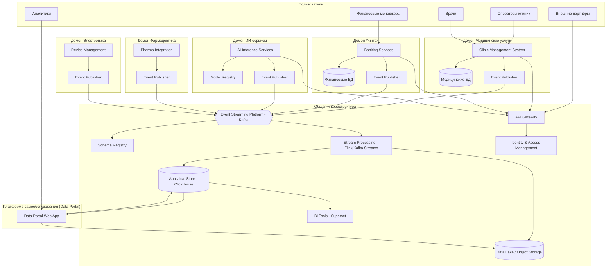
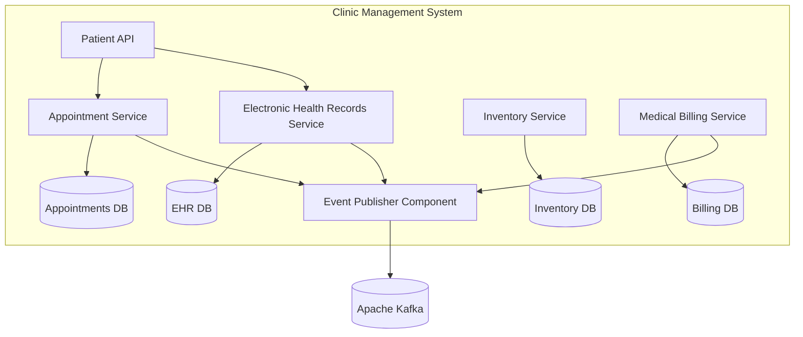
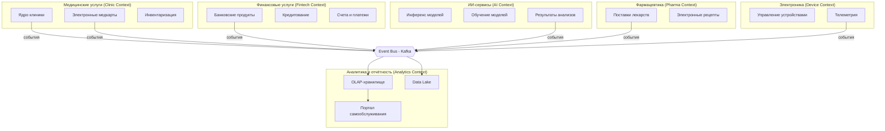
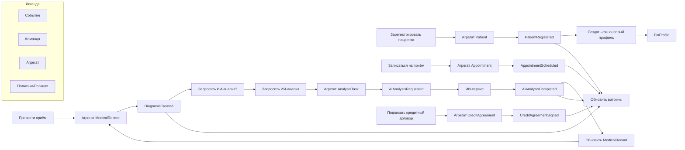

# Задание 1

## Создана папка Task1Advanced
```bash
Task1Advanced/
├── envs
│   ├── dev
│   │   ├── main.tf
│   │   ├── terraform.tfvars
│   │   └── variables.tf
│   ├── prod
│   │   ├── main.tf
│   │   ├── terraform.tfvars
│   │   └── variables.tf
│   └── stage
│       ├── main.tf
│       ├── terraform.tfvars
│       └── variables.tf
├── modules
│   └── vm
│       ├── main.tf
│       ├── outputs.tf
│       └── variables.tf
└── README.md
```

## Модуль виртуальной машины (vm_module)

Универсальный Terraform-модуль для создания виртуальной машины с дополнительным диском в Yandex Cloud.  
Поддерживает параметризацию ресурсов и конфигурацию через `.tfvars` для разных окружений (dev, stage, prod).

## Параметры модуля

| Переменная            | Тип    | Описание                                      | По умолчанию |
|-----------------------|--------|-----------------------------------------------|--------------|
| vm_name               | string | Имя ВМ                                        | —            |
| cores                 | number | Количество vCPU                               | —            |
| memory                | number | Объём RAM (ГБ)                                | —            |
| image_id              | string | ID образа загрузочного диска                  | —            |
| subnet_id             | string | ID подсети                                    | —            |
| zone                  | string | Зона доступности                              | —            |
| ssh_public_key        | string | Публичный SSH-ключ                            | —            |
| additional_disk_size  | number | Размер дополнительного диска (ГБ)             | 10           |

## Выходные переменные (outputs)

- `instance_id` – ID виртуальной машины.
- `instance_name` – Имя виртуальной машины.
- `external_ip` – Внешний IP-адрес (NAT).
- `additional_disk_id` – ID дополнительного диска данных.

## Как использовать

### Подготовка

1. Установите Terraform (>= 1.0).
2. Настройте аутентификацию Yandex Cloud (через `YC_TOKEN` или сервисный аккаунт).
3. Подставьте актуальные `image_id`, `subnet_id`, `zone` и SSH-ключ в файлы `.tfvars`.

### Запуск для конкретного окружения (dev)

```bash
cd envs/dev
terraform init
terraform plan -var-file="terraform.tfvars"
terraform apply -var-file="terraform.tfvars"
```

# Задание 2

Выбран движок  CI/CD - GitLab.
- Отраслевой стандарт
- [Личное мнение] Я не очень люблю GitHub Actions
- Более удобный (на мой взгляд) и функциональный, чем Jenkins

## Предварительные требования
- Yandex Cloud: облако, каталог, сервисный аккаунт с ролями `editor` и `storage.uploader`.
- Object Storage: бакет для tfstate (рекомендуется включить версионирование).
- GitLab репозиторий.

## Переменные GitLab CI/CD

| Имя переменной            | Тип       | Описание |
|---------------------------|-----------|----------|
| `YC_SERVICE_ACCOUNT_KEY`  | Variable  | JSON-содержимое ключа сервисного аккаунта Yandex Cloud. |
| `BACKEND_ACCESS_KEY`      | Variable  | Статический ключ доступа Object Storage (access_key). |
| `BACKEND_SECRET_KEY`      | Variable  | Секретный ключ (secret_key). |
| `CLOUD_ID`                | Variable  | ID облака. |
| `FOLDER_ID`               | Variable  | ID каталога. |
| `BACKEND_BUCKET`          | Variable  | Имя бакета Object Storage. |

Рекомендуется пометить переменные `BACKEND_SECRET_KEY` и `YC_SERVICE_ACCOUNT_KEY` как **protected** и **masked**.

## Работа пайплайна
- **init** – инициализация Terraform с подключением к удалённому состоянию.
- **plan** – формирование плана изменений и сохранение артефакта `tfplan`.
- **apply** – ручной шаг (кнопка «Run» в пайплайне), выполняется только на ветке `main`. Применяет ранее созданный план.

## Локальный запуск (для отладки)
Создайте файл `terraform.tfvars` по образцу `terraform.tfvars.example`.  
Установите переменные окружения:
```bash
export YC_SERVICE_ACCOUNT_KEY_FILE=путь_к_ключу.json
export BACKEND_ACCESS_KEY=...
export BACKEND_SECRET_KEY=...
```

# Задание 3

## Задание 3. Целевая архитектура и оценка рисков

### 1. Целевая архитектура «Будущее 2.0»

Целевое состояние — слабосвязанная событийная платформа, построенная по принципам Data Mesh. Домены независимо развивают свои сервисы и данные, взаимодействуя через события и асинхронные потоки. Монолитные хранилища (DWH на SQL Server) и центральная шина (ESB Camel) полностью замещены.

#### 1.1. Уровень контейнеров (C4 Container Diagram)



**Описание изменений:**
- Легаси-системы (DWH SQL Server, ESB Camel, PowerBuilder) выведены из эксплуатации. Их функции распределены по доменам и потоковой платформе.
- Каждый домен владеет собственными операционными данными и публикует бизнес-события в общую шину Kafka.
- Аналитическая платформа строится на Data Lake и OLAP-хранилище, куда данные поступают через потоковую обработку. Витрина самообслуживания (Data Portal) позволяет конструировать отчёты без вовлечения IT, используя только агрегированные и обезличенные данные (без медицинских карт).
- Интеграция новых направлений (фармацевтика, электроника) реализуется простым подключением к шине событий и соблюдением контрактов (схем).

#### 1.2. Уровень компонентов для домена «Медицинские услуги» (пример)



**Пояснение:** Внутри домена сервисы разделены по бизнес-сущностям. Для взаимодействия с другими доменами используется компонент-издатель событий, который гарантирует согласованность схем и асинхронную отправку.

---

### 2. Карта рисков трансформации

| № | Риск | Вероятность | Влияние | Техническая/Управленческая природа |
|---|------|-------------|---------|-----------------------------------|
| 1 | Потеря или искажение данных при миграции с легаси-систем | Высокая | Высокое | Техническая |
| 2 | Простой критичных сервисов в период перехода | Средняя | Высокое | Техническая + Управленческая |
| 3 | Несоблюдение регуляторных требований (152-ФЗ, банковская тайна) при обработке данных в облаке | Средняя | Высокое | Техническая + Управленческая |
| 4 | Недостаток компетенций команды для работы с событийной архитектурой и облачными технологиями | Высокая | Среднее | Управленческая |
| 5 | Фрагментация данных и потеря целостности отчётности из-за распределённой природы Data Mesh | Средняя | Среднее | Техническая + Управленческая |
| 6 | Утечка чувствительных медицинских/финансовых данных через витрину самообслуживания | Низкая | Высокое | Техническая |
| 7 | Блокировка со стороны регуляторов из-за размещения медицинских данных в облаке | Низкая | Высокое | Управленческая |
| 8 | Зависимость от облачного провайдера и рост затрат | Средняя | Низкое | Управленческая |
| 9 | Неприятие новой системы пользователями (врачи, операторы) | Средняя | Среднее | Управленческая |

---

### 3. План управления рисками

#### 3.1 Технические меры

| Риск | Мера |
|------|------|
| Потеря данных (1) | Создание полных резервных копий легаси-систем, многократное тестовое восстановление, параллельная эксплуатация старой и новой систем с верификацией данных, использование стратегии «strangler fig» с постепенным замещением функционала. |
| Простой сервисов (2) | Поэтапная миграция по доменам с сине-зелёным развёртыванием и канареечными релизами. Резервирование критических компонентов в разных зонах доступности. |
| Регуляторные нарушения (3) | Шифрование данных в покое и при передаче, использование аттестованных облачных сегментов (например, Yandex Cloud для 152-ФЗ), внедрение Data Loss Prevention (DLP), аудит доступа, маскирование чувствительных данных в аналитических слоях. |
| Фрагментация отчётности (5) | Внедрение единого каталога схем (Schema Registry), централизованного governance данных, Data Lineage, регулярная сверка агрегированных показателей между доменами и центральным озером. |
| Утечка данных через витрину (6) | Реализация атрибутного доступа (ABAC), автоматическое маскирование/псевдонимизация медицинских карт и результатов исследований на уровне ETL, аудит всех запросов к витрине, регулярный пентест. |

#### 3.2 Управленческие меры

| Риск | Мера |
|------|------|
| Недостаток компетенций (4) | Программа повышения квалификации: тренинги по Kafka, облачным сервисам, Data Mesh. Найм опытных инженеров, создание центра компетенций (CoE). Пилотные проекты в некритичных доменах для обучения. |
| Регуляторная блокировка (7) | Раннее привлечение юридического отдела и DPO, получение заключений регуляторов о допустимости облачной архитектуры, резервный план по размещению чувствительных данных в частном облаке или on-premise сегменте. |
| Зависимость от провайдера (8) | Использование open-source технологий (Kafka, Kubernetes), абстрагирование облачных сервисов через API, регулярный анализ мультиоблачной стратегии, отказ от проприетарных форматов хранения. |
| Сопротивление пользователей (9) | Раннее вовлечение ключевых пользователей в проектирование, создание «чемпионов» в каждом подразделении, итеративная доставка ценности (быстрые победы), обучение и поддержка 24/7 в переходный период. |

# Задание 4


### 1. Схема Bounded Contexts (`bounded-contexts.md`)



**Описание границ:**
- **Clinic Context** – все аспекты медицинского обслуживания, включая приемы, истории болезней и инвентаризацию клиник. Не включает ИИ-обработку (только отправляет задания и получает результаты).
- **Fintech Context** – банковские услуги: счета, кредиты, финансовые операции клиентов.
- **AI Context** – независимый домен, предоставляющий услуги ИИ-анализа медицинских данных (снимки, диагностика). Получает задания через события, публикует результаты.
- **Pharma Context** – интеграция с фармацевтическими партнёрами, учёт рецептов и поставок.
- **Device Context** – производитель и поставщик медицинского оборудования; передаёт телеметрию и события о состоянии устройств.
- **Analytics Context** – потребитель всех событий, строит отчёты и витрины данных, обеспечивает self-service аналитику без доступа к чувствительным медицинским записям.

---

### 2. Каталог доменных событий (`events.md`)

| Событие | Контекст-источник | Семантика | Минимальный контракт (ключевые поля) | Подписчики |
|---------|-------------------|-----------|-------------------------------------|-----------|
| `PatientRegistered` | Clinic Context | Новый пациент зарегистрирован в системе. | `patientId`, `fullName`, `birthDate`, `registrationDate` | Analytics, Fintech (для создания финансового профиля) |
| `AppointmentScheduled` | Clinic Context | Пациенту назначен приём. | `appointmentId`, `patientId`, `doctorId`, `scheduledTime` | Analytics, AI (если требуется предобработка) |
| `DiagnosisCreated` | Clinic Context | Врач поставил диагноз (после приёма или ИИ-ассистента). | `diagnosisId`, `patientId`, `doctorId`, `icdCode`, `description` | Analytics, Fintech (для страховых случаев) |
| `AIAnalysisRequested` | Clinic Context | Отправлен запрос на ИИ-анализ снимка/исследования. | `requestId`, `patientId`, `studyType`, `imageUrl` | AI Context |
| `AIAnalysisCompleted` | AI Context | ИИ-сервис завершил анализ, готов результат. | `requestId`, `resultId`, `findings`, `confidence` | Clinic Context (обновление карты), Analytics |
| `CreditAgreementSigned` | Fintech Context | Клиент подписал кредитный договор. | `agreementId`, `customerId`, `amount`, `rate`, `signDate` | Analytics |
| `PaymentProcessed` | Fintech Context | Платёж по счёту/кредиту обработан. | `paymentId`, `agreementId`, `amount`, `timestamp` | Analytics, Clinic (если оплата за услуги) |
| `InventoryItemUsed` | Clinic Context | Медикамент/расходник использован во время процедуры. | `itemId`, `patientId`, `quantity`, `procedureId` | Analytics, Pharma Context (для автозаказа) |
| `DeviceAlertGenerated` | Device Context | Оборудование сообщило об ошибке или превышении порога. | `deviceId`, `alertType`, `value`, `timestamp` | Analytics, Clinic (для обслуживания) |
| `RecipeIssued` | Pharma Context | Выписан электронный рецепт. | `recipeId`, `patientId`, `medicationId`, `dosage` | Clinic Context, Analytics |

---

### 3. Описание агрегатов (`aggregates.md`)

#### Агрегаты Clinic Context
- **Patient** (корень: `patientId`). Инварианты: уникальность комбинации паспорт/полис, возраст > 0. Содержит демографические данные, контакты.
- **MedicalRecord** (корень: `recordId`, ссылка на `patientId`). Инварианты: запись всегда привязана к пациенту и посещению. Хранит диагнозы, назначения, результаты исследований (не включая ИИ-сырые данные).
- **Appointment** (корень: `appointmentId`). Инварианты: врач и пациент активны, время не пересекается для врача.

#### Агрегаты Fintech Context
- **Account** (корень: `accountId`, владелец `customerId`). Инварианты: баланс не может быть отрицательным (для дебетовых), операции только в статусе «подтверждена».
- **CreditAgreement** (корень: `agreementId`). Инварианты: сумма > 0, ставка в допустимом диапазоне, клиент дееспособен.
- **Payment** (корень: `paymentId`). Инварианты: сумма > 0, связан со счётом и/или договором.

#### Агрегаты AI Context
- **AnalysisTask** (корень: `taskId`). Инварианты: привязан к пациенту и исследованию, статус изменяется по workflow (Pending → Processing → Completed/Failed).
- **ModelVersion** (корень: `modelId`). Инварианты: версия активна/неактивна, метрики качества.

#### Агрегаты Device Context
- **Device** (корень: `deviceId`). Инварианты: серийный номер уникален, статус (онлайн/оффлайн) соответствует последнему heartbeat.

Приведены ключевые агрегаты, обеспечивающие согласованность внутри bounded context. Межконтекстное взаимодействие исключительно через события.

---

### 4. Event Storming диаграмма (`event-storming.md`)



На схеме показаны основные команды, агрегаты, события и реактивные политики. Подписчиками событий могут быть другие домены или аналитический контекст, который обновляет витрины данных.

---

### 5. Обоснование событийного подхода (`justification.md`)

**Текущие проблемы с шиной ESB (Apache Camel) и DWH:**
- **Жёсткая связность.** Интеграции через центральную шину синхронны и требуют одновременной доступности всех систем. Любое изменение контракта ломает взаимодействие.
- **Зависимость от DWH.** Бизнес-логика и трансформации данных в хранилище замедляют time-to-market: добавление нового отчёта или направления требует модификации монолитного DWH.
- **Пакетная обработка.** Данные в DWH обновляются периодически, что не позволяет перейти к near-real-time аналитике и оперативной реакции на события.
- **Масштабирование.** Расширение числа бизнес-направлений ведёт к росту сложности шины и DWH, превращая их в «бутылочное горлышко».

**Преимущества событийной архитектуры на Kafka:**
- **Слабая связность.** Домены общаются через неизменяемые факты (события), не зная друг о друге. Издатель не зависит от подписчиков.
- **Независимость развёртывания.** Каждый домен может развиваться и масштабироваться автономно, публикуя события по стандартным схемам.
- **Real-time аналитика.** Потоковая обработка событий позволяет строить отчёты с задержкой в секунды, а не часы, что критично для финтеха и мониторинга пациентов.
- **Устойчивость к сбоям.** События сохраняются в логе Kafka и могут быть перечитаны, что гарантирует доставку даже при временной недоступности потребителя.
- **Простое подключение новых доменов.** Новый контекст (фармацевтика, электроника) просто начинает читать нужные события, не требуя изменений в ядре системы.
- **Разделение ответственности.** Источники истины (агрегаты) находятся в доменах, а аналитика строится на потоке событий, что исключает дублирование бизнес-логики в хранилище.

**Почему это лучше Camel + DWH:**
Camel остаётся лишь временным «мостом совместимости» на период миграции. В целевой архитектуре он не нужен: все интеграции асинхронны, а поток событий служит единым каналом для операционных и аналитических сценариев. DWH замещается совокупностью Data Lake, потоковой обработки и OLAP, что даёт невероятную гибкость и скорость реакции.