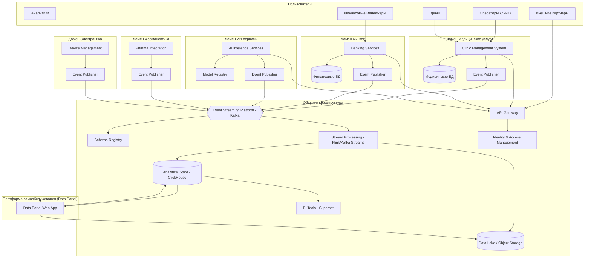
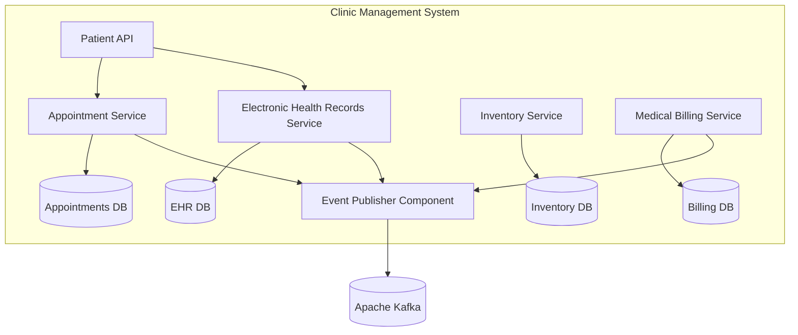

## Задание 3. Целевая архитектура и оценка рисков

### 1. Целевая архитектура «Будущее 2.0»

Целевое состояние — слабосвязанная событийная платформа, построенная по принципам Data Mesh. Домены независимо развивают свои сервисы и данные, взаимодействуя через события и асинхронные потоки. Монолитные хранилища (DWH на SQL Server) и центральная шина (ESB Camel) полностью замещены.

#### 1.1. Уровень контейнеров (C4 Container Diagram)

**Описание изменений:**
- Легаси-системы (DWH SQL Server, ESB Camel, PowerBuilder) выведены из эксплуатации. Их функции распределены по доменам и потоковой платформе.
- Каждый домен владеет собственными операционными данными и публикует бизнес-события в общую шину Kafka.
- Аналитическая платформа строится на Data Lake и OLAP-хранилище, куда данные поступают через потоковую обработку. Витрина самообслуживания (Data Portal) позволяет конструировать отчёты без вовлечения IT, используя только агрегированные и обезличенные данные (без медицинских карт).
- Интеграция новых направлений (фармацевтика, электроника) реализуется простым подключением к шине событий и соблюдением контрактов (схем).

#### 1.2. Уровень компонентов для домена «Медицинские услуги» (пример)

**Пояснение:** Внутри домена сервисы разделены по бизнес-сущностям. Для взаимодействия с другими доменами используется компонент-издатель событий, который гарантирует согласованность схем и асинхронную отправку.

---

### 2. Карта рисков трансформации

| № | Риск | Вероятность | Влияние | Техническая/Управленческая природа |
|---|------|-------------|---------|-----------------------------------|
| 1 | Потеря или искажение данных при миграции с легаси-систем | Высокая | Высокое | Техническая |
| 2 | Простой критичных сервисов в период перехода | Средняя | Высокое | Техническая + Управленческая |
| 3 | Несоблюдение регуляторных требований (152-ФЗ, банковская тайна) при обработке данных в облаке | Средняя | Высокое | Техническая + Управленческая |
| 4 | Недостаток компетенций команды для работы с событийной архитектурой и облачными технологиями | Высокая | Среднее | Управленческая |
| 5 | Фрагментация данных и потеря целостности отчётности из-за распределённой природы Data Mesh | Средняя | Среднее | Техническая + Управленческая |
| 6 | Утечка чувствительных медицинских/финансовых данных через витрину самообслуживания | Низкая | Высокое | Техническая |
| 7 | Блокировка со стороны регуляторов из-за размещения медицинских данных в облаке | Низкая | Высокое | Управленческая |
| 8 | Зависимость от облачного провайдера и рост затрат | Средняя | Низкое | Управленческая |
| 9 | Неприятие новой системы пользователями (врачи, операторы) | Средняя | Среднее | Управленческая |

---

### 3. План управления рисками

#### 3.1 Технические меры

| Риск | Мера |
|------|------|
| Потеря данных (1) | Создание полных резервных копий легаси-систем, многократное тестовое восстановление, параллельная эксплуатация старой и новой систем с верификацией данных, использование стратегии «strangler fig» с постепенным замещением функционала. |
| Простой сервисов (2) | Поэтапная миграция по доменам с сине-зелёным развёртыванием и канареечными релизами. Резервирование критических компонентов в разных зонах доступности. |
| Регуляторные нарушения (3) | Шифрование данных в покое и при передаче, использование аттестованных облачных сегментов (например, Yandex Cloud для 152-ФЗ), внедрение Data Loss Prevention (DLP), аудит доступа, маскирование чувствительных данных в аналитических слоях. |
| Фрагментация отчётности (5) | Внедрение единого каталога схем (Schema Registry), централизованного governance данных, Data Lineage, регулярная сверка агрегированных показателей между доменами и центральным озером. |
| Утечка данных через витрину (6) | Реализация атрибутного доступа (ABAC), автоматическое маскирование/псевдонимизация медицинских карт и результатов исследований на уровне ETL, аудит всех запросов к витрине, регулярный пентест. |

#### 3.2 Управленческие меры

| Риск | Мера |
|------|------|
| Недостаток компетенций (4) | Программа повышения квалификации: тренинги по Kafka, облачным сервисам, Data Mesh. Найм опытных инженеров, создание центра компетенций (CoE). Пилотные проекты в некритичных доменах для обучения. |
| Регуляторная блокировка (7) | Раннее привлечение юридического отдела и DPO, получение заключений регуляторов о допустимости облачной архитектуры, резервный план по размещению чувствительных данных в частном облаке или on-premise сегменте. |
| Зависимость от провайдера (8) | Использование open-source технологий (Kafka, Kubernetes), абстрагирование облачных сервисов через API, регулярный анализ мультиоблачной стратегии, отказ от проприетарных форматов хранения. |
| Сопротивление пользователей (9) | Раннее вовлечение ключевых пользователей в проектирование, создание «чемпионов» в каждом подразделении, итеративная доставка ценности (быстрые победы), обучение и поддержка 24/7 в переходный период. |