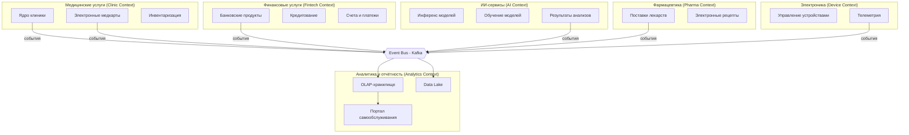
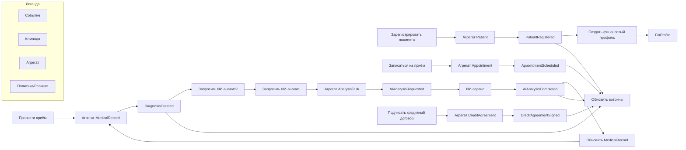

### 1. Схема Bounded Contexts (`bounded-contexts.md`)

**Описание границ:**
- **Clinic Context** – все аспекты медицинского обслуживания, включая приемы, истории болезней и инвентаризацию клиник. Не включает ИИ-обработку (только отправляет задания и получает результаты).
- **Fintech Context** – банковские услуги: счета, кредиты, финансовые операции клиентов.
- **AI Context** – независимый домен, предоставляющий услуги ИИ-анализа медицинских данных (снимки, диагностика). Получает задания через события, публикует результаты.
- **Pharma Context** – интеграция с фармацевтическими партнёрами, учёт рецептов и поставок.
- **Device Context** – производитель и поставщик медицинского оборудования; передаёт телеметрию и события о состоянии устройств.
- **Analytics Context** – потребитель всех событий, строит отчёты и витрины данных, обеспечивает self-service аналитику без доступа к чувствительным медицинским записям.

---

### 2. Каталог доменных событий (`events.md`)

| Событие | Контекст-источник | Семантика | Минимальный контракт (ключевые поля) | Подписчики |
|---------|-------------------|-----------|-------------------------------------|-----------|
| `PatientRegistered` | Clinic Context | Новый пациент зарегистрирован в системе. | `patientId`, `fullName`, `birthDate`, `registrationDate` | Analytics, Fintech (для создания финансового профиля) |
| `AppointmentScheduled` | Clinic Context | Пациенту назначен приём. | `appointmentId`, `patientId`, `doctorId`, `scheduledTime` | Analytics, AI (если требуется предобработка) |
| `DiagnosisCreated` | Clinic Context | Врач поставил диагноз (после приёма или ИИ-ассистента). | `diagnosisId`, `patientId`, `doctorId`, `icdCode`, `description` | Analytics, Fintech (для страховых случаев) |
| `AIAnalysisRequested` | Clinic Context | Отправлен запрос на ИИ-анализ снимка/исследования. | `requestId`, `patientId`, `studyType`, `imageUrl` | AI Context |
| `AIAnalysisCompleted` | AI Context | ИИ-сервис завершил анализ, готов результат. | `requestId`, `resultId`, `findings`, `confidence` | Clinic Context (обновление карты), Analytics |
| `CreditAgreementSigned` | Fintech Context | Клиент подписал кредитный договор. | `agreementId`, `customerId`, `amount`, `rate`, `signDate` | Analytics |
| `PaymentProcessed` | Fintech Context | Платёж по счёту/кредиту обработан. | `paymentId`, `agreementId`, `amount`, `timestamp` | Analytics, Clinic (если оплата за услуги) |
| `InventoryItemUsed` | Clinic Context | Медикамент/расходник использован во время процедуры. | `itemId`, `patientId`, `quantity`, `procedureId` | Analytics, Pharma Context (для автозаказа) |
| `DeviceAlertGenerated` | Device Context | Оборудование сообщило об ошибке или превышении порога. | `deviceId`, `alertType`, `value`, `timestamp` | Analytics, Clinic (для обслуживания) |
| `RecipeIssued` | Pharma Context | Выписан электронный рецепт. | `recipeId`, `patientId`, `medicationId`, `dosage` | Clinic Context, Analytics |

---

### 3. Описание агрегатов (`aggregates.md`)

#### Агрегаты Clinic Context
- **Patient** (корень: `patientId`). Инварианты: уникальность комбинации паспорт/полис, возраст > 0. Содержит демографические данные, контакты.
- **MedicalRecord** (корень: `recordId`, ссылка на `patientId`). Инварианты: запись всегда привязана к пациенту и посещению. Хранит диагнозы, назначения, результаты исследований (не включая ИИ-сырые данные).
- **Appointment** (корень: `appointmentId`). Инварианты: врач и пациент активны, время не пересекается для врача.

#### Агрегаты Fintech Context
- **Account** (корень: `accountId`, владелец `customerId`). Инварианты: баланс не может быть отрицательным (для дебетовых), операции только в статусе «подтверждена».
- **CreditAgreement** (корень: `agreementId`). Инварианты: сумма > 0, ставка в допустимом диапазоне, клиент дееспособен.
- **Payment** (корень: `paymentId`). Инварианты: сумма > 0, связан со счётом и/или договором.

#### Агрегаты AI Context
- **AnalysisTask** (корень: `taskId`). Инварианты: привязан к пациенту и исследованию, статус изменяется по workflow (Pending → Processing → Completed/Failed).
- **ModelVersion** (корень: `modelId`). Инварианты: версия активна/неактивна, метрики качества.

#### Агрегаты Device Context
- **Device** (корень: `deviceId`). Инварианты: серийный номер уникален, статус (онлайн/оффлайн) соответствует последнему heartbeat.

Приведены ключевые агрегаты, обеспечивающие согласованность внутри bounded context. Межконтекстное взаимодействие исключительно через события.

---

### 4. Event Storming диаграмма (`event-storming.md`)

На схеме показаны основные команды, агрегаты, события и реактивные политики. Подписчиками событий могут быть другие домены или аналитический контекст, который обновляет витрины данных.

---

### 5. Обоснование событийного подхода (`justification.md`)

**Текущие проблемы с шиной ESB (Apache Camel) и DWH:**
- **Жёсткая связность.** Интеграции через центральную шину синхронны и требуют одновременной доступности всех систем. Любое изменение контракта ломает взаимодействие.
- **Зависимость от DWH.** Бизнес-логика и трансформации данных в хранилище замедляют time-to-market: добавление нового отчёта или направления требует модификации монолитного DWH.
- **Пакетная обработка.** Данные в DWH обновляются периодически, что не позволяет перейти к near-real-time аналитике и оперативной реакции на события.
- **Масштабирование.** Расширение числа бизнес-направлений ведёт к росту сложности шины и DWH, превращая их в «бутылочное горлышко».

**Преимущества событийной архитектуры на Kafka:**
- **Слабая связность.** Домены общаются через неизменяемые факты (события), не зная друг о друге. Издатель не зависит от подписчиков.
- **Независимость развёртывания.** Каждый домен может развиваться и масштабироваться автономно, публикуя события по стандартным схемам.
- **Real-time аналитика.** Потоковая обработка событий позволяет строить отчёты с задержкой в секунды, а не часы, что критично для финтеха и мониторинга пациентов.
- **Устойчивость к сбоям.** События сохраняются в логе Kafka и могут быть перечитаны, что гарантирует доставку даже при временной недоступности потребителя.
- **Простое подключение новых доменов.** Новый контекст (фармацевтика, электроника) просто начинает читать нужные события, не требуя изменений в ядре системы.
- **Разделение ответственности.** Источники истины (агрегаты) находятся в доменах, а аналитика строится на потоке событий, что исключает дублирование бизнес-логики в хранилище.

**Почему это лучше Camel + DWH:**
Camel остаётся лишь временным «мостом совместимости» на период миграции. В целевой архитектуре он не нужен: все интеграции асинхронны, а поток событий служит единым каналом для операционных и аналитических сценариев. DWH замещается совокупностью Data Lake, потоковой обработки и OLAP, что даёт невероятную гибкость и скорость реакции.