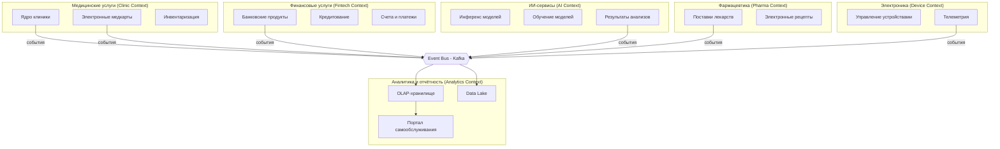

**Описание границ:**
- **Clinic Context** – все аспекты медицинского обслуживания, включая приемы, истории болезней и инвентаризацию клиник. Не включает ИИ-обработку (только отправляет задания и получает результаты).
- **Fintech Context** – банковские услуги: счета, кредиты, финансовые операции клиентов.
- **AI Context** – независимый домен, предоставляющий услуги ИИ-анализа медицинских данных (снимки, диагностика). Получает задания через события, публикует результаты.
- **Pharma Context** – интеграция с фармацевтическими партнёрами, учёт рецептов и поставок.
- **Device Context** – производитель и поставщик медицинского оборудования; передаёт телеметрию и события о состоянии устройств.
- **Analytics Context** – потребитель всех событий, строит отчёты и витрины данных, обеспечивает self-service аналитику без доступа к чувствительным медицинским записям.
