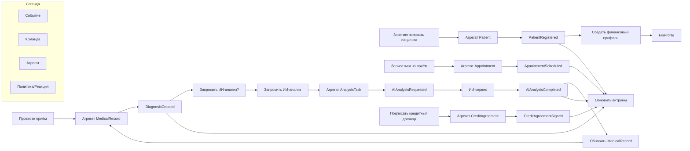

```mermaid
flowchart LR
    subgraph Легенда
        direction LR
        E[Событие]
        C[Команда]
        A[Агрегат]
        P[Политика/Реакция]
    end

    %% Цепочка: пациент регистрируется -> запись на приём -> приём -> диагноз -> запрос ИИ -> результат ИИ
    C1[Зарегистрировать пациента] --> A_Patient[Агрегат Patient]
    A_Patient --> E1[PatientRegistered]
    E1 --> P1[Создать финансовый профиль] --> A_FinProfile[FinProfile]

    C2[Записаться на приём] --> A_Appointment[Агрегат Appointment]
    A_Appointment --> E2[AppointmentScheduled]

    C3[Провести приём] --> A_MedicalRecord[Агрегат MedicalRecord]
    A_MedicalRecord --> E3[DiagnosisCreated]
    E3 --> P2[Запросить ИИ-анализ?] --> C4[Запросить ИИ-анализ]

    C4 --> A_AITask[Агрегат AnalysisTask]
    A_AITask --> E4[AIAnalysisRequested]
    E4 --> A_AIService[ИИ-сервис]
    A_AIService --> E5[AIAnalysisCompleted]
    E5 --> P3[Обновить MedicalRecord] --> A_MedicalRecord

    %% Финансовые события
    C5[Подписать кредитный договор] --> A_CreditAgreement[Агрегат CreditAgreement]
    A_CreditAgreement --> E6[CreditAgreementSigned]

    %% Аналитика реагирует на все события
    E1 --> P_Analytics[Обновить витрины]
    E2 --> P_Analytics
    E3 --> P_Analytics
    E5 --> P_Analytics
    E6 --> P_Analytics
```

На схеме показаны основные команды, агрегаты, события и реактивные политики. Подписчиками событий могут быть другие домены или аналитический контекст, который обновляет витрины данных.