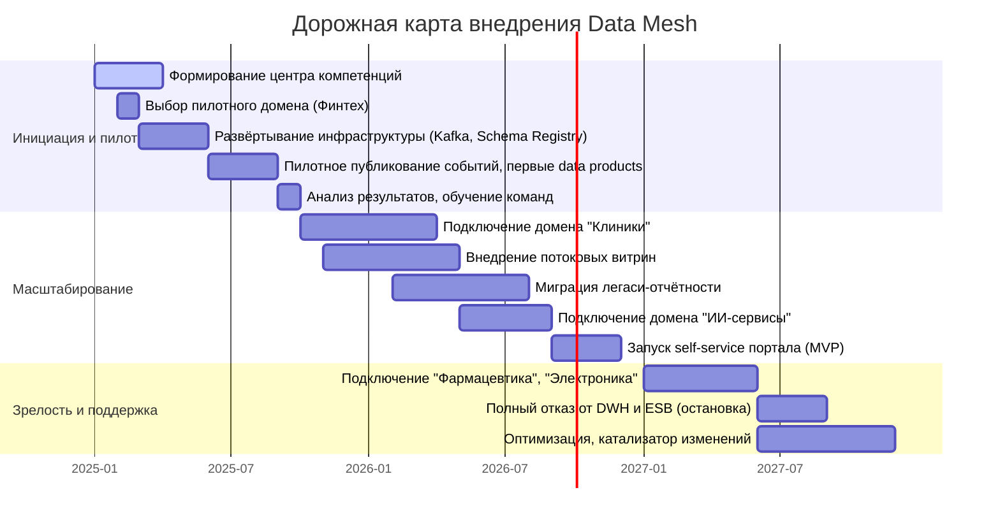

### 1. Расширенный технический радар (`tech-radar.md`)

Радар включает технологии и архитектурные паттерны с их статусами внедрения в компании «Будущее 2.0» на горизонте трёх лет.

#### Таблица статусов (Adopt, Trial, Assess, Hold)

| Категория               | Технология/Паттерн              | Статус | Обоснование |
|-------------------------|----------------------------------|--------|-------------|
| **Архитектурные паттерны** | Data Mesh                        | Adopt  | Ключевой подход для масштабирования, декомпозиции и независимости доменов. |
|                         | Event-Driven Architecture        | Adopt  | Обеспечивает слабую связность, near-real-time аналитику и асинхронное взаимодействие. |
|                         | Self-Service BI                  | Adopt  | Цель трансформации — дать бизнес-пользователям самостоятельный доступ к отчётам. |
| **Потоковая обработка** | Apache Kafka                     | Adopt  | Основная событийная шина, замена Camel и синхронной интеграции. |
|                         | Kafka Streams / Apache Flink     | Trial  | Для сложных потоковых трансформаций и обогащения в реальном времени (пилот). |
| **Хранение и аналитика**| Data Lake (Object Storage)       | Adopt  | Единое озеро для сырых данных, событий и долгосрочного хранения. |
|                         | ClickHouse / Greenplum           | Trial  | OLAP-хранилище с высокой производительностью для витрин самообслуживания. |
|                         | Superset                         | Trial  | BI-инструмент с открытым кодом для self-service аналитики. |
| **Облачная инфраструктура** | Kubernetes                  | Adopt  | Оркестрация контейнеров, обеспечивает независимость развёртывания доменов. |
|                         | Terraform                       | Adopt  | Инфраструктура как код, модульность, повторяемость. |
| **Управление данными**  | Schema Registry (Apicurio)       | Adopt  | Централизованный каталог схем событий для совместимости. |
|                         | Data Catalog (OpenMetadata)      | Assess | Оценка для внедрения Data Discovery и Lineage (поздние этапы). |
| **Безопасность**        | Keycloak                         | Adopt  | Единый IAM с поддержкой ABAC/SSO. |
| **Легаси-компоненты**   | Microsoft SQL Server (DWH)       | Hold   | Заменяется целевой архитектурой; временно сохраняется как мост совместимости. |
|                         | Apache Camel (ESB)               | Hold   | Выводится из эксплуатации, заменён Kafka. |
|                         | PowerBuilder                     | Hold   | Клиентский интерфейс заменяется на современные веб-приложения. |
|                         | Power BI                         | Hold   | Мигрирует на Superset для снижения лицензионных затрат; пока используется для сравнения. |
| **Языки и фреймворки**  | Python (для ИИ)                  | Adopt  | Основной язык AI-сервисов. |
|                         | Golang / Java (финтех)           | Adopt  | Высоконагруженные банковские микросервисы. |

#### Диаграмма радара (aoe_technology_radar)
 
 команда Dokcer

 ```bash
docker-compose up --build
 ```

 Перейти http://localhost:8080

 


### 2. TCO-анализ (`tco-analysis.md`)

Сравнение совокупной стоимости владения текущей (легаси) и целевой архитектуры на горизонте 3 лет (в млн. руб., приблизительные оценки для компании масштаба «Будущее 2.0»).

#### Статьи затрат

**Текущая архитектура**
- **Инфраструктура (on-premise):** 10 серверов (аренда/амортизация), СХД, сетевое оборудование – 15 млн/год.
- **Лицензии:** SQL Server Enterprise, Power BI Premium, PowerBuilder – 8 млн/год.
- **Сопровождение и поддержка:** 3 администратора БД, 2 разработчика PowerBuilder, 2 инженера по интеграции – 18 млн/год (ФОТ).
- **Время аналитиков:** 4 бизнес-аналитика создают отчёты вручную, ожидание DWH – эквивалент 5 млн/год потерь продуктивности.
- **Прочие (электричество, охлаждение):** 2 млн/год.
- **Итого за 3 года:** (15+8+18+5+2) × 3 = **144 млн. руб.**

**Целевая архитектура (облачная + событийная)**
- **Облачная инфраструктура:** Kubernetes кластер, Object Storage, Kafka, ClickHouse (Yandex Cloud) – 20 млн/год.
- **Лицензии:** Открытое ПО (Kafka, Superset) – 0, платные managed-сервисы включены в облако (1.5 млн/год поддержка enterprise-версий).
- **Сопровождение и поддержка:** 2 Data Engineer, 2 SRE, 1 Data Product Owner – 15 млн/год (ФОТ).
- **Время аналитиков:** Self-service BI, сокращение времени подготовки отчётов – выигрыш 3 млн/год.
- **Миграция (разово):** Консультанты, переписывание логики, обучение – 12 млн (распределены на 2 года).
- **Итого за 3 года:** 20×3 + 1.5×3 + 15×3 - 3×3 + 12 = (60 + 4.5 + 45 - 9 + 12) = **112.5 млн. руб.**

**Экономия:** 144 - 112.5 = **31.5 млн. руб.** (22%) за 3 года. Кроме того, целевая архитектура позволяет быстрее запускать новые продукты (ускорение time-to-market), что даёт дополнительный неоцениваемый доход.

#### Таблица TCO (млн. руб.)

| Статья                     | Текущая (3 года) | Целевая (3 года) | Разница   |
|----------------------------|------------------|------------------|-----------|
| Инфраструктура             | 45               | 60               | +15       |
| Лицензии                   | 24               | 4.5              | -19.5     |
| Сопровождение (ФОТ)        | 54               | 45               | -9        |
| Время аналитиков           | 15               | -9               | -24       |
| Прочие + миграция          | 6                | 12               | +6        |
| **Итого**                  | **144**          | **112.5**        | **-31.5** |

Анализ показывает, что даже с учётом более дорогой облачной инфраструктуры (гибкость и масштабируемость) отказ от проприетарных лицензий, оптимизация штата и повышение эффективности аналитиков дают существенную экономию.

### 3. Стратегический роадмап внедрения Data Mesh (`roadmap.md`)

Роадмап привязан к этапам трансформации (0–36 месяцев) и ключевым бизнес-целям.

#### Ключевые роли

- **Data Product Owner (DPO):** Владелец доменных данных, определяет, какие data products публикует домен, отвечает за качество и контракты. В каждом домене (клиники, финтех, ИИ) должен быть свой DPO.
- **Data Engineer:** Разрабатывает пайплайны данных, потоковую обработку, поддерживает инфраструктуру Data Mesh.
- **BI-аналитик:** Строит отчёты в self-service среде, консультирует бизнес-пользователей.

#### Этапы роадмапа



#### Подробный план этапов

**Этап 0–6 месяцев (пилот)**
- **Бизнес-цели:** Продемонстрировать ценность событийного подхода, снизить время построения отчётности в одном домене.
- Действия: Назначить Data Product Owner в финтех-домене, нанять двух data engineers. Развернуть Kafka-кластер и Schema Registry. Пилот: публикация событий `PaymentProcessed`, `CreditAgreementSigned`, построение первой потоковой витрины. Обучение BI-аналитиков работе с Superset.

**Этап 6–18 месяцев (масштабирование)**
- **Бизнес-цели:** Сократить time-to-market для новых продуктов, перенести клиническую аналитику (без медкарт) в новую среду.
- Действия: DPO в клиническом домене, расширение команды data engineers до 4 человек. Подключение домена клиник, публикация событий `PatientRegistered`, `AppointmentScheduled`. Построение потоковых витрин для операторов и руководства. Запуск бета-версии портала самообслуживания.

**Этап 18–36 месяцев (зрелость)**
- **Бизнес-цели:** Полный уход от легаси, интеграция новых бизнес-направлений, выход на near-real-time отчётность.
- Действия: Добавление доменов фармацевтики и электроники с их DPO. Отказ от синхронных интеграций через Camel, отключение DWH SQL Server. Self-service портал доступен всем аналитикам. Постоянная оптимизация и развитие культуры работы с данными.