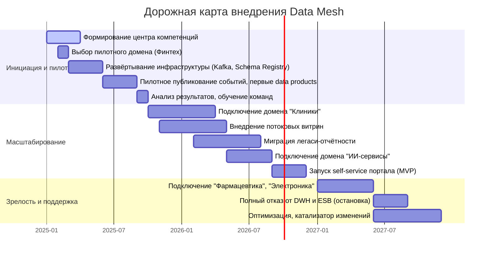

Роадмап привязан к этапам трансформации (0–36 месяцев) и ключевым бизнес-целям.

#### Ключевые роли

- **Data Product Owner (DPO):** Владелец доменных данных, определяет, какие data products публикует домен, отвечает за качество и контракты. В каждом домене (клиники, финтех, ИИ) должен быть свой DPO.
- **Data Engineer:** Разрабатывает пайплайны данных, потоковую обработку, поддерживает инфраструктуру Data Mesh.
- **BI-аналитик:** Строит отчёты в self-service среде, консультирует бизнес-пользователей.

#### Этапы роадмапа

#### Подробный план этапов

**Этап 0–6 месяцев (пилот)**
- **Бизнес-цели:** Продемонстрировать ценность событийного подхода, снизить время построения отчётности в одном домене.
- Действия: Назначить Data Product Owner в финтех-домене, нанять двух data engineers. Развернуть Kafka-кластер и Schema Registry. Пилот: публикация событий `PaymentProcessed`, `CreditAgreementSigned`, построение первой потоковой витрины. Обучение BI-аналитиков работе с Superset.

**Этап 6–18 месяцев (масштабирование)**
- **Бизнес-цели:** Сократить time-to-market для новых продуктов, перенести клиническую аналитику (без медкарт) в новую среду.
- Действия: DPO в клиническом домене, расширение команды data engineers до 4 человек. Подключение домена клиник, публикация событий `PatientRegistered`, `AppointmentScheduled`. Построение потоковых витрин для операторов и руководства. Запуск бета-версии портала самообслуживания.

**Этап 18–36 месяцев (зрелость)**
- **Бизнес-цели:** Полный уход от легаси, интеграция новых бизнес-направлений, выход на near-real-time отчётность.
- Действия: Добавление доменов фармацевтики и электроники с их DPO. Отказ от синхронных интеграций через Camel, отключение DWH SQL Server. Self-service портал доступен всем аналитикам. Постоянная оптимизация и развитие культуры работы с данными.