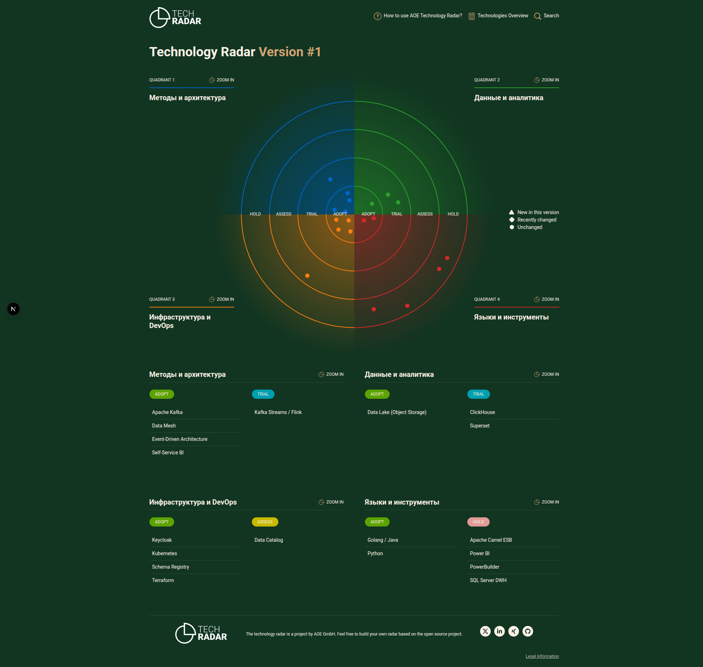

Радар включает технологии и архитектурные паттерны с их статусами внедрения в компании «Будущее 2.0» на горизонте трёх лет.

#### Таблица статусов (Adopt, Trial, Assess, Hold)

| Категория               | Технология/Паттерн              | Статус | Обоснование |
|-------------------------|----------------------------------|--------|-------------|
| **Архитектурные паттерны** | Data Mesh                        | Adopt  | Ключевой подход для масштабирования, декомпозиции и независимости доменов. |
|                         | Event-Driven Architecture        | Adopt  | Обеспечивает слабую связность, near-real-time аналитику и асинхронное взаимодействие. |
|                         | Self-Service BI                  | Adopt  | Цель трансформации — дать бизнес-пользователям самостоятельный доступ к отчётам. |
| **Потоковая обработка** | Apache Kafka                     | Adopt  | Основная событийная шина, замена Camel и синхронной интеграции. |
|                         | Kafka Streams / Apache Flink     | Trial  | Для сложных потоковых трансформаций и обогащения в реальном времени (пилот). |
| **Хранение и аналитика**| Data Lake (Object Storage)       | Adopt  | Единое озеро для сырых данных, событий и долгосрочного хранения. |
|                         | ClickHouse / Greenplum           | Trial  | OLAP-хранилище с высокой производительностью для витрин самообслуживания. |
|                         | Superset                         | Trial  | BI-инструмент с открытым кодом для self-service аналитики. |
| **Облачная инфраструктура** | Kubernetes                  | Adopt  | Оркестрация контейнеров, обеспечивает независимость развёртывания доменов. |
|                         | Terraform                       | Adopt  | Инфраструктура как код, модульность, повторяемость. |
| **Управление данными**  | Schema Registry (Apicurio)       | Adopt  | Централизованный каталог схем событий для совместимости. |
|                         | Data Catalog (OpenMetadata)      | Assess | Оценка для внедрения Data Discovery и Lineage (поздние этапы). |
| **Безопасность**        | Keycloak                         | Adopt  | Единый IAM с поддержкой ABAC/SSO. |
| **Легаси-компоненты**   | Microsoft SQL Server (DWH)       | Hold   | Заменяется целевой архитектурой; временно сохраняется как мост совместимости. |
|                         | Apache Camel (ESB)               | Hold   | Выводится из эксплуатации, заменён Kafka. |
|                         | PowerBuilder                     | Hold   | Клиентский интерфейс заменяется на современные веб-приложения. |
|                         | Power BI                         | Hold   | Мигрирует на Superset для снижения лицензионных затрат; пока используется для сравнения. |
| **Языки и фреймворки**  | Python (для ИИ)                  | Adopt  | Основной язык AI-сервисов. |
|                         | Golang / Java (финтех)           | Adopt  | Высоконагруженные банковские микросервисы. |

#### Диаграмма радара (aoe_technology_radar)
 
 команда Dokcer

 ```bash
docker-compose up --build
 ```

 Перейти http://localhost:8080

 

